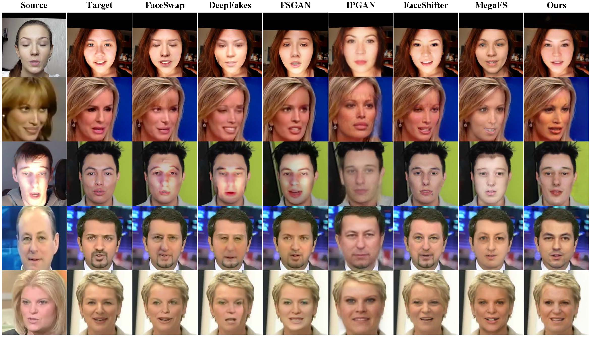

## FaceSwapper - Official PyTorch Implementation


> **FaceSwapper: Learning Disentangled Representation for One-shot Progressive Face Swapping**<br>
> [Qi Li](https://liqi-casia.github.io/), [Weining Wang](https://scholar.google.com/citations?hl=en&user=NDPvobAAAAAJ), [Chengzhong Xu](https://www.fst.um.edu.mo/people/czxu/), [Zhenan Sun](https://scholar.google.com.au/citations?user=PuZGODYAAAAJ&hl=en)<br>
> In arxiv 2022. <br>


> Paper: https://arxiv.org/abs/2203.12985/<br>


> <p align="justify"> Although face swapping has attracted much attention in recent years, it remains a challenging problem. The existing methods leverage a large number of data samples to explore the intrinsic properties of face swapping without taking into account the semantic information of face images. Moreover, the representation of the identity information tends to be fixed, leading to suboptimal face swapping. In this paper, we present a simple yet efficient method named FaceSwapper, for one-shot face swapping based on Generative Adversarial Networks. Our method consists of a disentangled representation module and a semantic-guided fusion module. The disentangled representation module is composed of an attribute encoder and an identity encoder, which aims to achieve the disentanglement of the identity and the attribute information. The identity encoder is more flexible and the attribute encoder contains more details of the attributes than its competitors. Benefiting from the disentangled representation, FaceSwapper can swap face images progressively. In addition, semantic information is introduced into the semantic-guided fusion module to control the swapped area and model the pose and expression more accurately. The experimental results show that our method achieves state-of-the-art results on benchmark datasets with fewer training samples.</p>


><p align="left"></p>


## Environment
Clone this repository:

```bash
git clone https://github.com/liqi-casia/FaceSwapper.git
cd FaceSwapper/
```

Install the dependencies:
```bash
conda create -n faceswapper python=3.6.7
conda activate faceswapper
conda install -y pytorch=1.4.0 torchvision=0.5.0 cudatoolkit=10.0 -c pytorch
conda install x264=='1!152.20180717' ffmpeg=4.0.2 -c conda-forge
pip install opencv-python==4.1.2.30 ffmpeg-python==0.2.0 scikit-image==0.16.2
pip install pillow==7.0.0 scipy==1.2.1 tqdm==4.43.0 munch==2.5.0
conda install -y -c anaconda pyyaml
pip install tensorboard tensorboardX

```


## Datasets and pre-trained checkpoints
We provide a link to download datasets used in FaceSwapper and the corresponding pre-trained checkpoints. The datasets and checkpoints should be moved to the `data` and `expr/checkpoints` directories, respectively.

* Datasets. Click here to download the **CelebA Dataset** through [Baidu Netdisk](https://pan.baidu.com/s/12KqrRI_K9frgky2YPNSJ0Q?pwd=wvy5) or [Google Drive](https://drive.google.com/file/d/1W-FF-DNJ752L7Zqdm-otMT6frOcTLd7q/view?usp=sharing) and the **FaceForensics++ Dataset** through [Baidu Netdisk](https://pan.baidu.com/s/1LcKJw2sGkEAHWjmTcxou-A?pwd=omkc) or [Google Drive](https://drive.google.com/file/d/1Sa6v0m8s4xHXPPzeFt8K1q1n3T088Gvz/view?usp=sharing).

* Checkpoints. Click here to download the **face recognition model** through [Baidu Netdisk](https://pan.baidu.com/s/11qcEiBjAsQPXwIqKjOE-rQ?pwd=2g78) or [Google Drive](https://drive.google.com/file/d/1-lxc-jZGIFNdwFUXQ9tDS9OSuhadj6AC/view?usp=sharing), the **face alignment model** through [Baidu Netdisk](https://pan.baidu.com/s/1htwmXDi2Gev8l09oJpr_Mg?pwd=ejmj) or [Google Drive](https://drive.google.com/file/d/1lBt4x4P5qaClB2ZN_POBV-ue41hdlaoJ/view?usp=sharing), and the **face swapping model** through [Baidu Netdisk](https://pan.baidu.com/s/1aIRX0twylUJ42z4sYhUaVA?pwd=bkru) or [Google Drive](https://drive.google.com/file/d/1Tb3V09wbaGe6SaiN3BZkOcCy7VJ0KYC8/view?usp=sharing).  

After storing all the files, the directory structure of `./data` and `./pretrained_checkpoints` is expected as follows. 


```
./data
├── CelebA Dataset
│   ├── CalebA images
│   ├── CelebA landmark images
│   └── CelebA mask images
└── FF++ Dataset
    ├── ff++ images
    ├── ff++ landmark images
    ├── ff++ mask images
    └── ff++ parsing images

./pretrained_checkpoints
├── model_ir_se50.pth
├── wing.ckpt
└── faceswapper.ckpt
```


## Generating swapped images
After downloading the pre-trained checkpoints, you can synthesize swapped images. The following commands will save generated images to the `expr/results` directory. 


 <b>FaceForensics++ Dataset.</b> To generate swapped images, you need to specify the testing parameters in param.yaml (especially paramerters in *\#directory for testing* ). Then run the following command:
```bash
python main.py 
```
There are three subfolders in `expr/results/ff++/`, which are named `swapped_result_single`, `swapped_result_afterps` and `swapped_result_all`. Each image is named as *source_FS_target.png*, where source image provides the identity information and target image provides attribute information.

--`swapped_result_single`: the swapped images. 

--`swapped_result_afterps`:  the swapped images after post process.

--`swapped_result_all`: caoncatenation of the souce images, the target images, the swapped images and the 
swapped images after post process.

 <b>Other Datasets.</b> 
First,  crop and align face images from other datasets automatically so that the proportion of face occupied in the whole is similar to that of CelebA dataset and FaceForensics++ dataset. Then, define the face swapping list siimilar to `face_swap_list.txt` (`source_image_name target_image_name`). The other testing procedure is similar to FaceForensics++ Dataset.


<b>Post Process.</b> If occlusion exists in the source image (*e.g.*, hair, hat), we simply preserve the forehead and hair of the target image in the swapped image. 
Othewise, we simplely preserve the hair of the target image. You just need to Set `post_process: True`  if you want the post process.   


## Training networks


To train FaceSwapper from scratch, just set  the training parameters in param.yaml, and run the following commands. Generated images and network checkpoints will be stored in the `expr/samples` and `expr/checkpoints` directories, respectively. Training usually takes about several days on a single Tesla V100 GPU depending on the total trainig iterations. 


```bash
python main.py 
```


## License
The source code, pre-trained models, and dataset are available under [Creative Commons BY-NC 4.0](https://creativecommons.org/licenses/by-nc/4.0/) license. You can use, copy, tranform and build upon the material for non-commercial purposes as long as you give appropriate credit by citing our paper, and indicate if changes were made. 
For technical, business and other inquiries, please contact qli@nlpr.ia.ac.cn.<br/>	


## Citation
If you find this work useful for your research, please cite our paper:

```
@misc{li2022learning,
      title={Learning Disentangled Representation for One-shot Progressive Face Swapping}, 
      author={Qi Li and Weining Wang and Chengzhong Xu and Zhenan Sun},
      year={2022},
      eprint={2203.12985},
      archivePrefix={arXiv},
      primaryClass={cs.CV}
}

```

## Acknowledgements
The code is written based on the following projects. We would like to thank for their contributions.

- [Stargan V2](https://github.com/clovaai/stargan-v2)

- [face alignment](https://github.com/1adrianb/face-alignment)
- [AdaptiveWingLoss](https://github.com/protossw512/AdaptiveWingLoss)


